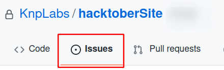

# hacktoberSite

The purpose of this repository is to provide a dummy project to help Hacktoberfest participants at KNP Labs to start during [HacktoberFest 2021 Event](https://knplabs.com/en/blog/hacktoberfest-2021-opensource-dans-nos-bureaux-a-nantes-et-a-caen).

## How to use it?

- Go check the issue page :

- Find one that is not already taken ;

- Clone the project ;

- Create a new branch with a descriptive name ;

- Code a feature ;

- Push your branch ;

- Submit a pull request from your newly pushed branch to `main` and [link it with the issue it revolves](https://docs.github.com/en/issues/tracking-your-work-with-issues/linking-a-pull-request-to-an-issue#manually-linking-a-pull-request-to-an-issue) ;

